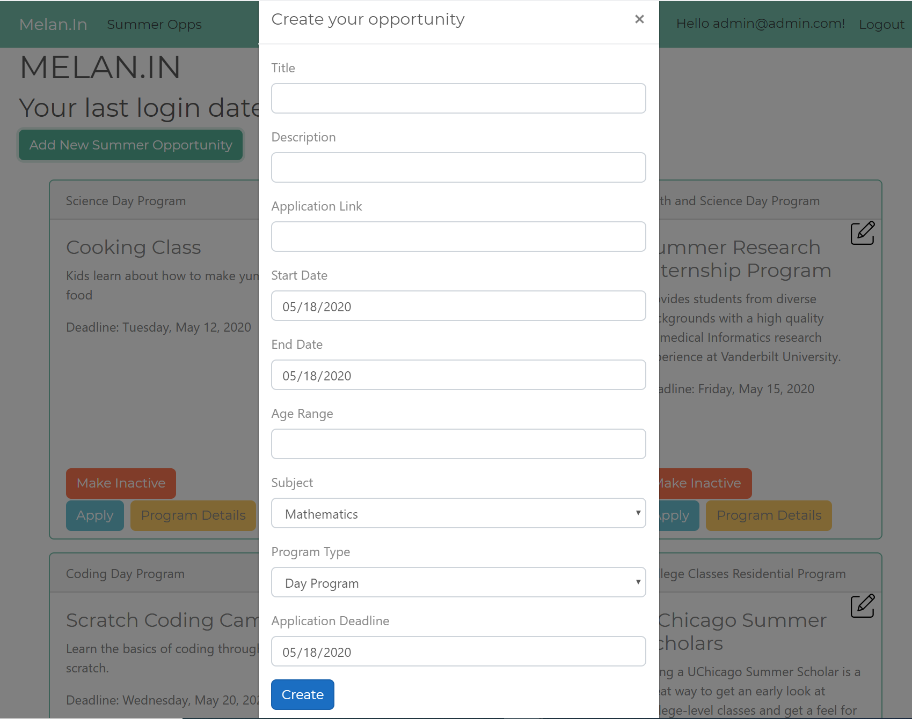

# Melan.In

Melan.In is a web application that allows student to view upcoming summer opportunities, add them to a checklist and mark off when completed. Students can also see when new opportunties have been added and can see progress on their cart along with last log-in time. Admin can add, edit and inactivate summer opportunities

Melan.In is an Asp.NetCore MVC web app with Entity and Identity Frameworks styled with a bootstrap theme from Bootswatch

<table>
  <tr>
    <td>Student Opportunities View</td>
     <td>Student Opportunities Cart View</td>
     <td>Admin Add Opportunity View</td>
  </tr>
  <tr>
    <td></td>
    <td></td>
    <td></td>
  </tr>
 </table>
## Installation

From your terminal run git clone SSH KEY HERE

Open Visual Studio

Under the tools tab, open the NuGet Package Manager console and run Update-Database to run migrations

Build and run the application after migrations are complete

## Usage
1. Register a new student user or sign into an existing account
2. On the Opportunities tab, add and remove opportunities to your cart
3. Click on Apply button to be taken to the external website for the summer program
4. Click on the Details button to be presented with a modal with additional information about the program
5. Click on the Opportunity Cart tab and click the checkbox to indicate your application is complete
6. Click on the trash can icon to delete from the Cart view 
7. Login as the admin 
8. Add a new opportunity and edit an opportunity by clicking on the pencil icon
9. Admin can also inactivate or activate a summer opportunity 
10. Re-login into the student view and you will see a notification indicating that a new opportunity has been added and the card will be a different color
